# qiaomu-design · 偏执型设计顾问

**中文** | [English](#english)

> 让 AI 做出“不像默认 AI 模板”的设计：先看四个真实方向，再把选定界面实现并验收到可交付。
>
> An opinionated Agent Skill for visual direction, implementation, and browser-based UI verification.

[](https://github.com/joeseesun/qiaomu-design/releases) [](https://github.com/joeseesun/qiaomu-design/commits/main) [](LICENSE) [更新日志](CHANGELOG.md)

**证据边界：** 核心机制来自受控横评与真实项目迭代；仓库案例可复查，但具体项目仍需逐次运行测试、桌面/移动端截图和交互验收。

**完整横评：** [前端设计 Skill 横评实验室](https://designskill.qiaomu.ai/) 展示 8 个主流变体 × 10 个任务的 80 个真实生成页面，qiaomu-design 与 impeccable 均已补齐全部任务。

## 执行者与模型

默认由当前执行代理直接完成，不因触发 skill 自动切换 K3 或其他外部模型。只有用户在当前任务明确点名 K3 时才调用；质量来自“发散 → 定义 → 选择 → 独立评审 → 删减 → 真实验收”的闭环，不来自模型名本身。

## 案例

### 视频案例 · 冥想网站

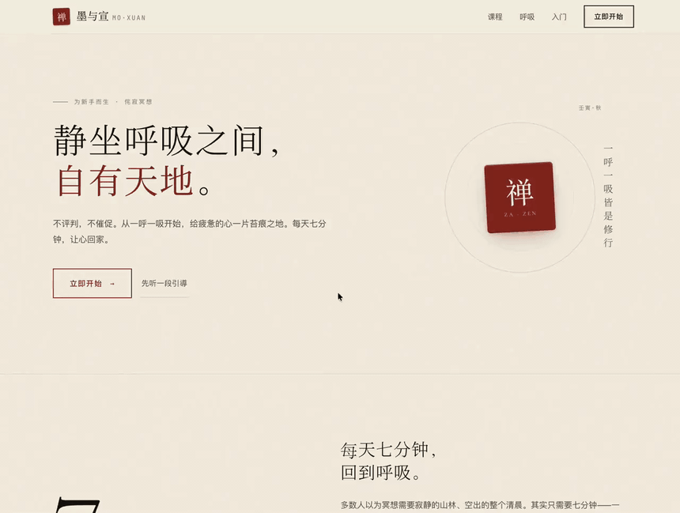

### 横评截图

以下 10 张截图来自 qiaomu-design 在横评实验里的真实生成页面。点击截图可打开线上可交互原始文件。

| 落地页 · AI 会议笔记 | 仪表盘 · 电商运营 |
|---|---|
| <a href="https://designskill.qiaomu.ai/pages/qiaomu-design/landing.html">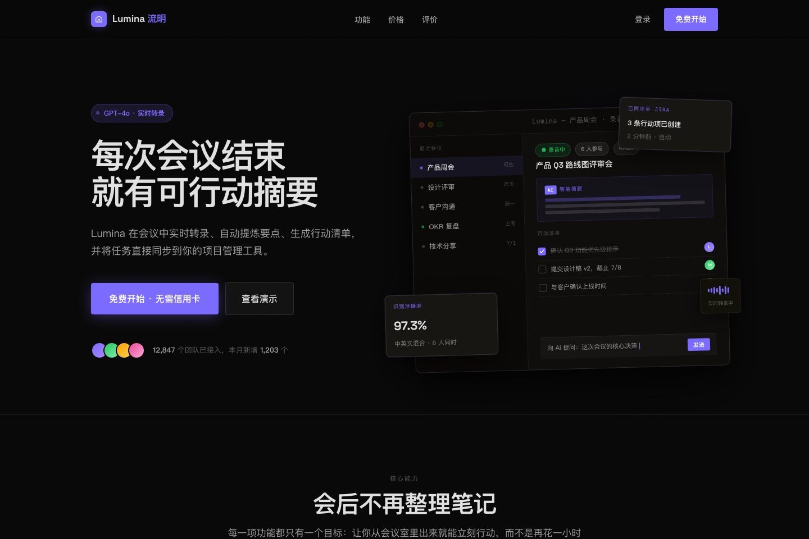</a> | <a href="https://designskill.qiaomu.ai/pages/qiaomu-design/dashboard.html">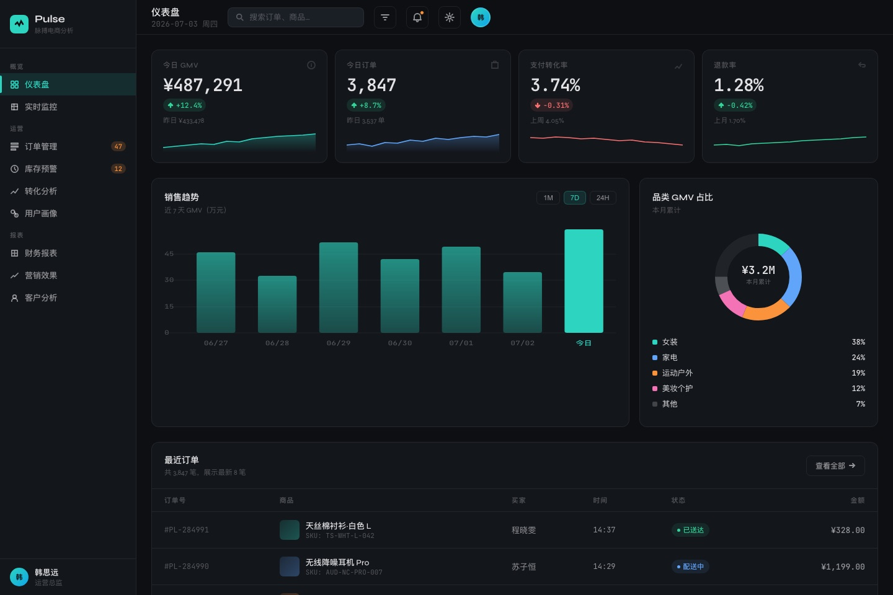</a> |

| 作品集 · 独立设计师 | 交互向导 · 机票预订 |
|---|---|
| <a href="https://designskill.qiaomu.ai/pages/qiaomu-design/portfolio.html">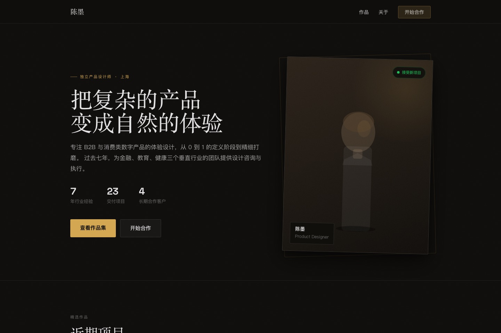</a> | <a href="https://designskill.qiaomu.ai/pages/qiaomu-design/wizard.html">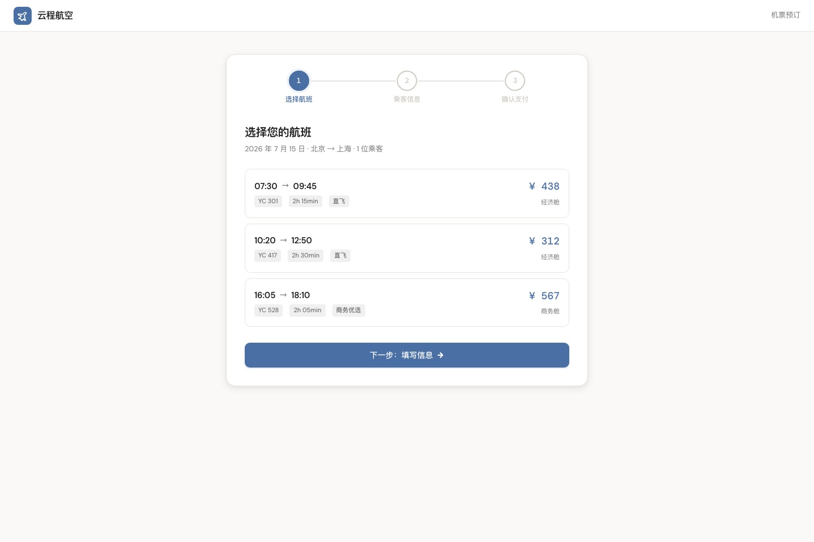</a> |

| 设置中心 · 危险操作组件 | 创意 404 · 星空航行 |
|---|---|
| <a href="https://designskill.qiaomu.ai/pages/qiaomu-design/components.html">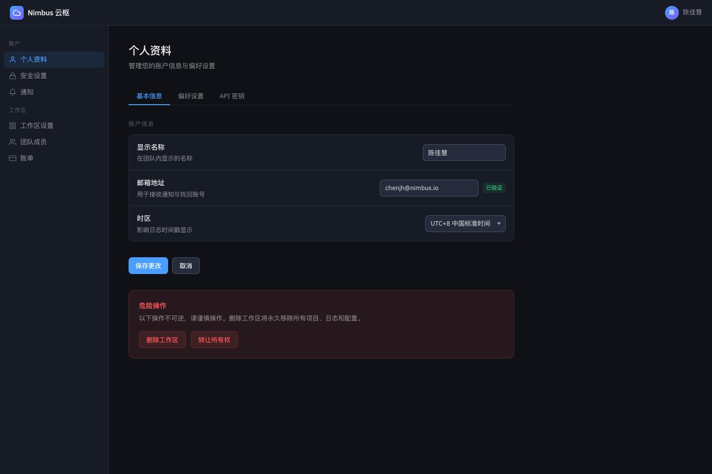</a> | <a href="https://designskill.qiaomu.ai/pages/qiaomu-design/error404.html">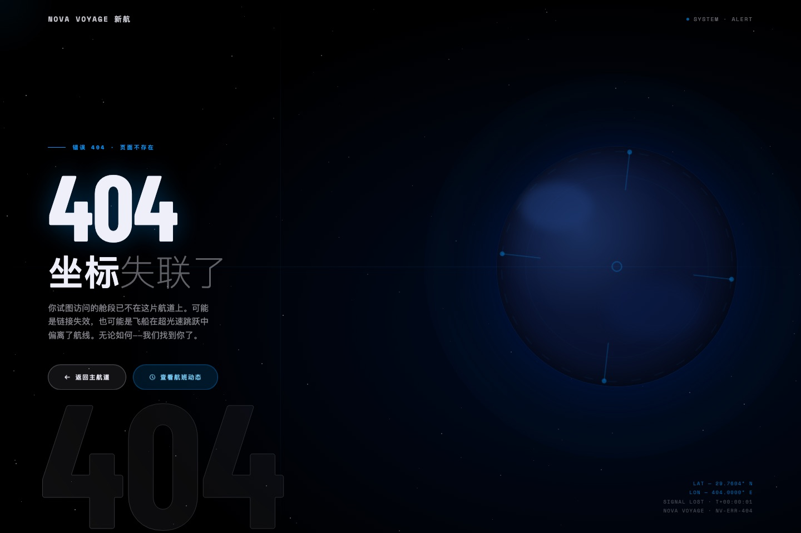</a> |

| 多样性挑战 · 三向播放器 | 电商详情 · 手冲咖啡器 |
|---|---|
| <a href="https://designskill.qiaomu.ai/pages/qiaomu-design/diversity.html">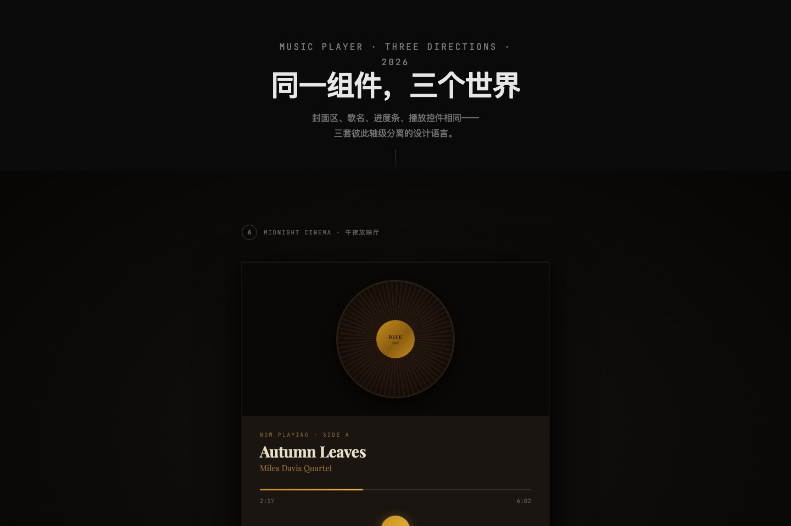</a> | <a href="https://designskill.qiaomu.ai/pages/qiaomu-design/detail.html">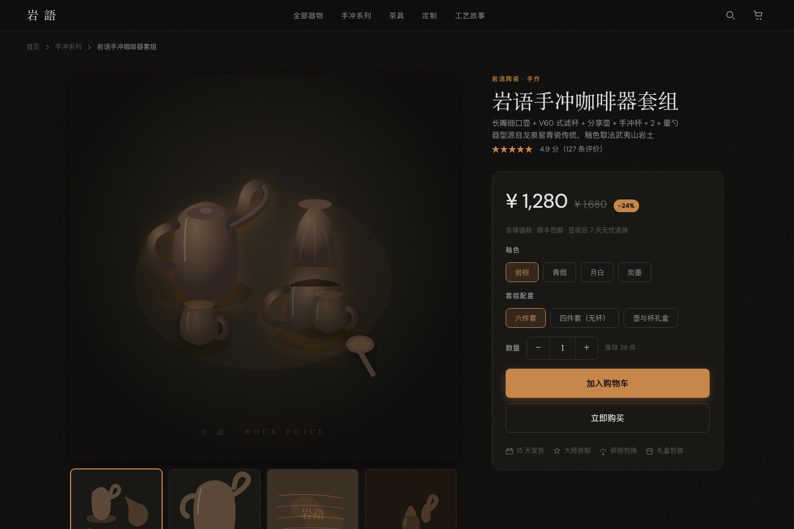</a> |

| 移动端 · 冥想助眠 App | 数据叙事 · 精品咖啡十年 |
|---|---|
| <a href="https://designskill.qiaomu.ai/pages/qiaomu-design/mobile.html">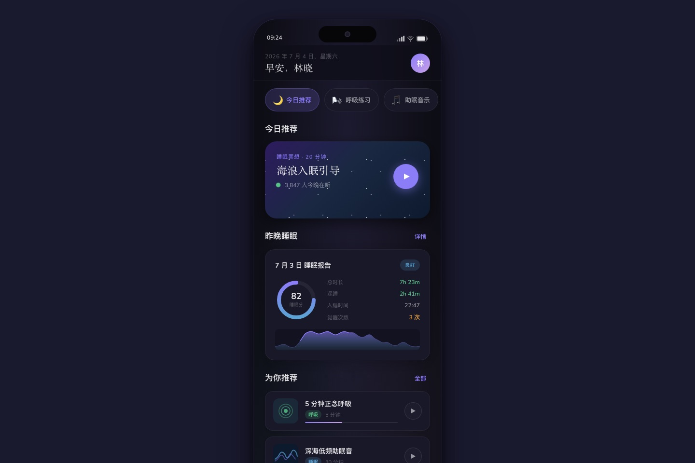</a> | <a href="https://designskill.qiaomu.ai/pages/qiaomu-design/story.html">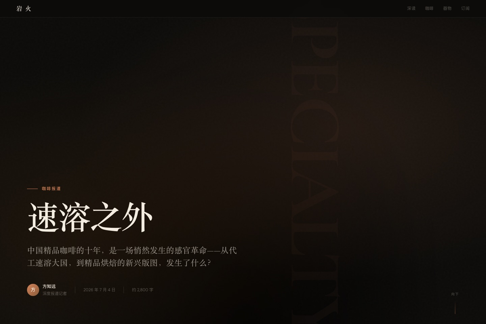</a> |

## 这是什么

一个把设计发散、方向选择、实现和视觉验收串成闭环的 Agent Skill。安装后，当你说"帮我设计 / 重新设计 / 优化界面"时，它会先诊断真实需求，再用**可视化风格试衣间**给你 4 个方向实际看着选，确认后由当前 Codex 修改真实文件并按工程验收标准交付——而不是直接吐一个紫渐变居中 Hero 的"AI 味"页面。

## 为什么值得用

大多数 AI 设计的问题不是画不好，而是：默认审美收敛、方向只有形容词、实现者自评产生偏差、不断做加法，以及最终过不了工程和中文排版验收。本 skill 为这些问题提供可执行、可检查的闭环。

## 核心能力

| 能力 | 你得到什么 |
|---|---|
| 执行者显式路由 | 默认当前 Codex 直接实现；只有用户在当前任务点名 K3 才调用，并保留隔离、diff 审查和独立验收 |
| 创意提示词编排 | 用独立创意种子、雄心命题、用户反应 brief、新上下文截图批评和删减通道，把 Discover → Define → Deliver 变成可执行流程 |
| 风格试衣间 | 4 个互斥方向的真实迷你 mockup，生成在 `design-previews/YYYY-MM-DD-任务名/index.html`，点选/键盘进入确认弹层，带拨盘与建议一起回传 |
| 设计读取 + 三拨盘 | 按任务类型自适应冒险度/动效/密度：功能页收敛、开放命题放开 |
| AI 反套路禁令 | 禁 AI 紫渐变、禁 Inter、禁斜体、禁居中套路、禁 AI 文案词——从源头消灭"AI 味" |
| 中文排版规范 | 系统字体栈优先、装饰中文字体子集化、盘古之白、行高/字重/标点纪律 |
| Emil 动效工艺套件 | `emil-design-eng` + `review-animations` + `animation-vocabulary` + `apple-design`：写动效、审动效、命名动效、做流体手势 |
| 工程验收清单 | Vercel 规范：a11y、表单、焦点陷阱、危险操作防护，`file:line` 格式审查 |
| Carbon 决策体系 | 基于官方 319 页索引，整合基础 token、组件选型、完整工作流、数据可视化与无障碍；借方法，不复制 IBM 外观 |
| 58 站设计系统库 | Stripe/Linear/Apple 等真实网站 DESIGN.md（Google Stitch 格式），可直接"参考 XX 做" |
| 打磨模式 | 已有页面不推倒重来：Audit/Critique/Polish/Animate/Harden/Live 六动作 |
| 交付门禁 | preflight 强制检查清单，任何一条不过就不交付 |
| 自进化机制 | 用户反馈自动抽象成规则写入偏好账本，越用越贴合你 |

## 快速开始

```bash
npx skills add joeseesun/qiaomu-design
```

然后在支持 Agent Skills 的客户端里直接说：

```
帮我设计一个产品落地页
```

<details>
<summary>手动安装</summary>

```bash
git clone https://github.com/joeseesun/qiaomu-design.git
cp -r qiaomu-design ~/.claude/skills/qiaomu-design
```

手动复制路径因客户端而异；优先使用上方 `npx skills add`。

</details>

## 前置条件与验证

- [ ] Node.js 与 `npx`：运行 `node --version && npx --version`
- [ ] 支持 Agent Skills 的客户端（例如 Codex 或 Claude Code）
- [ ] 若要交互式方向回传：本机可运行 `node --check scripts/qiaomu-design-preview-server.mjs`
- [ ] 若用户明确要求 K3：另行安装并验证 `qiaomu-model-cli`；默认不需要

安装后验证发现与目录：

```bash
npx skills add joeseesun/qiaomu-design --list
test -f ~/.agents/skills/qiaomu-design/SKILL.md
python3 /path/to/qiaomu-meta-skill/scripts/validate_skill.py ~/.agents/skills/qiaomu-design
```

## 你可以直接这样说

- “帮我重新设计这个产品首页，先给四个能直接看的方向。”
- “打磨这个已经能用的页面，去掉 AI 味但别推倒重来。”
- “审查这个仪表盘的信息层级、状态和移动端问题，先不要改。”
- “参考 Linear 的克制感，给我的开发者工具做一套设计系统。”
- “用 K3 实现我选中的 B 方向，并由当前代理独立验收。”（只有这类明确点名才调用 K3）

## 使用方式

**触发词**：重新设计 / redesign / 优化界面 / 设计方案 / UI 审查 / 帮我看看设计 / 参考 XX 的设计 / 给我一个设计系统

**典型流程**（三阶段，每阶段等你确认）：

```
你：帮我重新设计博客首页
 ↓ Phase 1  诊断：设计读取 + 三拨盘 + 2-3 个关键问题
 ↓ Phase 2  风格试衣间：生成 design-previews/YYYY-MM-DD-任务名/index.html
            4 个方向实际看着选，确认后把方向、拨盘和建议回传
 ↓ Phase 3  执行：先立 DESIGN.md 锚 → 写码 → preflight 门禁 → 交付
```

**已有页面要优化**：说"帮我打磨这个页面 / 反 AI 味 / 加动效"，走打磨模式，不推倒重来。

## 工作原理

```
SKILL.md                       人格 + 工作流 + 拨盘 + 反套路禁令 + 自进化协议
references/
  user-preferences.md          用户偏好账本（自进化写入，最高优先级）
  style-preview.md             风格试衣间规范（4 方向 + 手动确认回传）
  divergence-playbook.md       发散手册（轴级差异检验 + 14 种美学方向）
  creative-prompting.md        创意提示词编排（种子 / brief / 独立批评 / 媒体 / 删减）
  motion-craft.md              动效工艺（Emil Kowalski 体系）
  motion-review.md             动效专项审查（Before/After/Why + 阻断标准）
  animation-vocabulary.md      动效术语词典（把模糊描述转成准确 motion brief）
  apple-fluid-interfaces.md    Apple 流体交互（手势、弹簧、速度交接、透明材质）
  engineering-checklist.md     工程验收（Vercel WIG + 组件行为标准）
  carbon-foundations.md        Carbon 网格/token/排版/动效/内容/a11y/AI
  carbon-components.md         Carbon 组件选型矩阵 + 七问 dossier
  carbon-patterns.md           Carbon 表单/对话/状态/CRUD 完整工作流
  carbon-data-visualization.md Carbon 图表选型/轴/颜色/图例/仪表盘
  carbon-source-map.md         319 页 sitemap + 321 MDX 覆盖与刷新方法
  chinese-typography.md        中文排版与配色（W3C clreq / Ant Design / Apple HIG）
  preflight.md                 交付前门禁
  design-systems/{58 站}/      DESIGN.md 设计系统参考库
```

## 实测验证

规则不是拍脑袋写的。改造前先做了一场受控实验：6 个变体（anthropics/frontend-design、vercel/web-design-guidelines、ui-ux-pro-max、taste-skill、emil-design-eng、无 Skill 对照组）× 7 个任务（落地页/仪表盘/作品集/交互向导/组件面板/创意 404/多样性挑战）= 42 个页面，横评视觉个性、工程规范、动效工艺、交互完成度、组件合理性、创造性、多样性七个维度。

后续复测扩展为 [8 个变体 × 10 个任务的公开横评](https://designskill.qiaomu.ai/)，覆盖电商详情、移动端与数据叙事等新场景。采用的机制与来源记录在对应 `references/` 及下方致谢中。

这些结果证明的是案例与机制可复查，不等于所有未来输出自动达到同一质量；每个新项目仍要通过自己的功能、构建、浏览器和人工判断。

## 配置与权限边界

本 skill 没有必需环境变量。交互预览只在本机回环地址启动临时服务，并会在项目内写入
`design-previews/`；正式实现会修改用户明确放入范围的项目文件。外部参考、媒体生成、付费服务、
K3 或其他模型调用都需要当前任务的明确需求或授权。API key 只放本地受保护环境，不写入提示词、仓库或日志。

## 限制与边界

- 这是面向 Agent-Skills-compatible 客户端的 Skill，不是独立软件；效果依赖执行代理、项目上下文与验收质量
- 风格试衣间默认生成浅层任务目录：`design-previews/YYYY-MM-DD-任务名/index.html`；
  当前不在项目中时退到桌面目录；用户可以指定输出目录
- 点选回传依赖本地预览服务；服务失败时降级为打开 HTML 文件并在对话中回复选择
- 本 skill 只做设计，不会默认给生成页面注入打赏、公众号、GitHub/X 浮条或乔木个人 Profile；
  对外页面如需署名，建议只放低干扰页脚 `Powered by 向阳乔木` 链接到 `https://qiaomu.ai/`
- 58 站 DESIGN.md 库来自公开网站的设计系统提炼，用于风格参考，不代表对应公司背书
- 装饰性中文字体默认禁用（体积 5-20MB），只在创意标题场景子集化加载——这是特性不是缺陷

## Troubleshooting

| 问题 | 常见原因 | 解决 |
|---|---|---|
| `No valid skills found` | `SKILL.md` 未安装到客户端扫描路径或 frontmatter 损坏 | 先运行 `npx skills add ... --list`，再确认安装目录里存在根级 `SKILL.md` |
| 预览页能打开但选择没有回传 | 用 `file://` 打开，或本地服务已退出 | 用 `qiaomu-design-preview-server.mjs --file <index.html> --exit-on-select` 重启；静态模式则回到对话回复 A/B/C/D |
| 页面出现重复“选择方向”按钮 | 旧预览 HTML 与服务注入协议冲突 | 更新到最新版，确认每个方向只有一个 `.qmdp-pick-button`，删除旧 `selection.json` 后重开 |
| 中文字体加载慢或排版跳动 | 引入了完整 CJK Webfont | 正文改用系统中文字体栈；装饰标题只请求实际字符子集 |
| 触发后意外调用外部模型 | 旧版偏好或本地规则仍要求 K3 | 更新到 v3.9.0；默认当前代理执行，只有当前任务明确点名 K3 才调用 |

## 来源与致谢

MIT License。融合机制来源（详见 SKILL.md 血统说明）：[anthropics/skills](https://github.com/anthropics/skills) · [vercel-labs/web-interface-guidelines](https://github.com/vercel-labs/web-interface-guidelines) · [Leonxlnx/taste-skill](https://github.com/Leonxlnx/taste-skill) · [emilkowalski/skills](https://github.com/emilkowalski/skills) · [nextlevelbuilder/ui-ux-pro-max-skill](https://github.com/nextlevelbuilder/ui-ux-pro-max-skill) · [pbakaus/impeccable](https://github.com/pbakaus/impeccable) · [arvindrk/extract-design-system](https://github.com/arvindrk/extract-design-system) · [mattpocock/skills](https://github.com/mattpocock/skills) · [IBM Carbon Design System](https://carbondesignsystem.com/)（官方站点与 Apache-2.0 `carbon-website` 文档的重写摘要） · DESIGN.md 库基于 [VoltAgent/awesome-design-md](https://github.com/VoltAgent/awesome-design-md)（Google Stitch 格式）

<!-- qiaomu-profile:start -->
## 关于向阳乔木

向阳乔木（乔向阳 / Joe）是一位实践型 AI 产品与内容创作者，长期把前沿 AI 变化转译成可复用的工作流、产品判断、AI 编程实践、AI 搜索实践和 GEO/AI 营销方法。

- 个人网站: https://qiaomu.ai
- 博客: https://blog.qiaomu.ai
- X: https://x.com/vista8
- GitHub: https://github.com/joeseesun/
- 微信公众号: 向阳乔木推荐看

### 支持与关注

| 打赏支持 | 微信公众号 |
|---|---|
|  |  |
| 感谢支持乔木持续分享 AI 实践 | 扫码关注「向阳乔木推荐看」 |

<!-- qiaomu-profile:end -->

## License / 版权

MIT License。Copyright (c) 向阳乔木。

项目主页：[qiaomu.ai](https://qiaomu.ai/) · GitHub：[@joeseesun](https://github.com/joeseesun)

---

<a name="english"></a>

# English

**qiaomu-design** is an Agent Skill that helps AI-generated interfaces avoid default template aesthetics. It combines visual direction, implementation, and browser-based verification in one opinionated workflow.

## Install

```bash
npx skills add joeseesun/qiaomu-design
```

Then ask your Agent-Skills-compatible client: `redesign my landing page and show four visual directions first`.

## What you get

- **Explicit executor routing**: the current agent implements by default. K3 or any other external model is used only when the user explicitly requests it in the current task.
- **Style fitting room**: 4 mutually-divergent direction mockups (real fonts/colors/layout) in `design-previews/YYYY-MM-DD-task/index.html`. Pick by click or keys, confirm with dial values and optional notes, then the local preview server reports the selection back to the current workflow.
- **Design read + three dials**: VARIANCE / MOTION / DENSITY auto-tuned per task type — restrained on functional UI, bold on open creative briefs.
- **Anti-slop bans**: no AI-purple gradients, no Inter, no italics, no centered-hero clichés, no "revolutionary/seamless" copy.
- **Chinese typography rules**: system font stack first, subset decorative CJK webfonts (5-20 MB otherwise), CJK spacing/punctuation/line-height discipline.
- **Motion craft** (Emil Kowalski system) and **engineering checklist** (Vercel WIG): easing/durations/stagger, a11y, focus traps, destructive-action guards.
- **58 real-site DESIGN.md library** (Stripe, Linear, Apple…, Google Stitch format) for "make it like X" requests.
- **Polish mode** for existing pages (Audit/Critique/Polish/Animate/Harden/Live) — no rewrites from scratch.
- **Pre-flight gate**: a hard checklist; nothing ships if any item fails.
- **Self-evolution**: feedback is recorded as events, abstracted into evidence-backed candidate rules, explicitly approved, published to the preferences ledger, and verified or rolled back when it causes regressions.

## Verified

The first controlled comparison covered 6 variants × 7 tasks × 42 generated pages; the public follow-up expands to [8 variants × 10 tasks × 80 generated pages](https://designskill.qiaomu.ai/). The screenshots above link to interactive case pages. This evidence applies to those cases and mechanisms; every future project still needs its own tests and visual verification.

## Limits

Requires an Agent-Skills-compatible client. The fitting room is a local HTML preview served by a tiny local callback server; if the server cannot start, it falls back to a static file and asks the user to reply with the selected direction. qiaomu-design does not inject Qiaomu profile widgets into generated pages by default. The DESIGN.md library is distilled from public sites for reference, not endorsement.

MIT © 向阳乔木 · [qiaomu.ai](https://qiaomu.ai/) · [@joeseesun](https://github.com/joeseesun)
